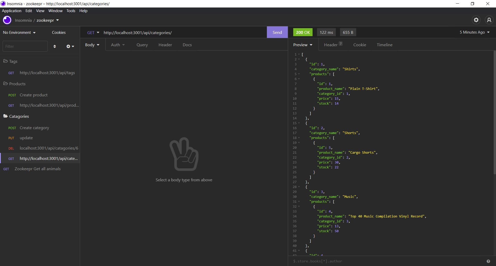

# eCommerce-backend
  

  ## Description:
  ___
  A back-end server for an e_commerce site, allowing for posting, puting and deleting products, catagories, and tags.

  ## Table of Contents:
  ___
  1) [Description](#description)
  2) [Installation](#installation)
  3) [Usage](#usage)
  4) [Video](#video)
  5) [Collaboration](#collaboration)
  6) [Tests](#tests)
  7) [Questions?](#questions?)
  8) [GitHub](#gitHub)
  9) [License](#license)

  ## Installation
  ___
  - `git clone ` application to your local machine.
  - `npm init -y`
  - `npm i `
  - `mysql -u root -p`
  - `source db/schema.sql`
  - `quit`
  - `npm run seed`
  - `npm start`

  ## Usage
  ___
  The use is to take a working Express.js API and configure it to use Sequalize to interact with a MySQL database.

  ## Video
  ___
 Here are some images:
{:target="_blank"}

  ## Collaboration:
  ___
  For now, just follow the [Contributor Covenant](https://www.contributor-covenant.org/)

  ## Tests
  ___
  none yet

  ## Questions?
  ___
  Please contact me at:
  My [GitHub](https://github.com/zaclark369)
  My [LinkedIn](https://www.linkedin.com/in/zachary-aclark/)
  
  Or Email:
  <zacclark369@gmail.com>

  
  ## License: 
  ___
  Licensed under [GNU GPL v3](https://www.gnu.org/licenses/gpl-3.0)
